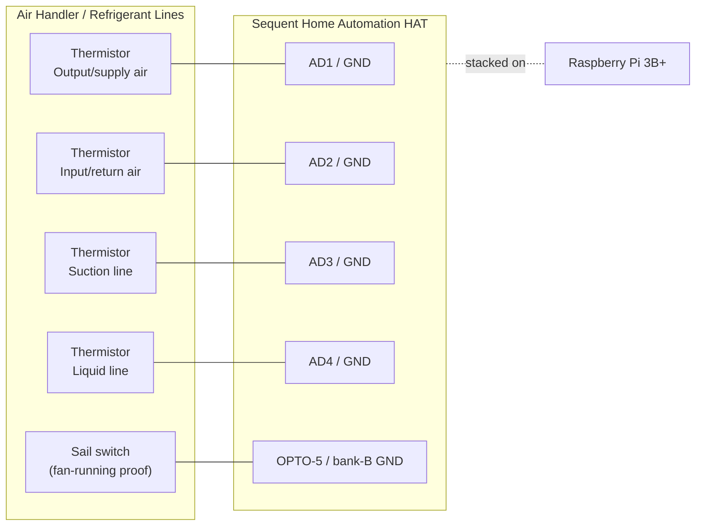

# Hardware & Wiring

This document describes the physical build: bill of materials, the I/O map on the
Sequent Home Automation HAT, and per-sensor wiring.

> **Every field signal terminates on the Sequent HAT.** Temperatures are read from 10 kΩ
> NTC thermistors on the HAT's analog inputs; airflow is proven by a dry-contact sail switch
> on an opto input. Nothing field-wired touches the Pi header.

> **Design change (2026):** earlier revisions used DS18B20 1-Wire probes for temperature and
> a Setra Model 265 differential-pressure transmitter on an analog input. Both were dropped —
> temperature now uses analog **10 kΩ NTC thermistors** (simpler, and the HAT's 1-Wire bus
> proved unreliable), and differential pressure is no longer part of the design. See git
> history if you need the retired Setra/1-Wire wiring.

## 1. Bill of materials

| Qty | Item | Notes |
|-----|------|-------|
| 1 | Raspberry Pi 3B+ | Any Pi with the 40-pin header works |
| 1 | Sequent Microsystems Home Automation HAT | Stack level 0 (DIP switches → all off) |
| 1 | 5 V / ≥3 A regulated power supply | Powers Pi + HAT |
| 4 | **DROK 10 kΩ B3950 NTC thermistor**, waterproof stainless probe, 3 m lead | Amazon `B01MZ6Y336`; −25 to 125 °C. 2× strap to refrigerant lines, 2× in the air stream |
| 1 | Sail switch (air-proving switch, SPDT dry contact) | e.g. a furnace/duct sail switch |
| — | Ferrules / 26–16 AWG wire | HAT uses pluggable screw terminals |

No external resistors are required: each analog input has a **15 kΩ pull-up to 3.3 V** built
into the HAT (forms the thermistor divider), and each opto input has a 1 kΩ pull-up for the
dry-contact sail switch.

## 2. HAT I/O map

The Sequent Home Automation HAT is driven over I²C by the Pi (via Sequent's `SMioplus`
Python library / `ioplus` CLI). Everything not listed is spare for future
control/expansion.

| HAT resource | Terminal | Assigned to | Type |
|---|---|---|---|
| Analog input 1 | `AD1` / `GND` | Thermistor — output (supply) air | 0–3.3 V ADC |
| Analog input 2 | `AD2` / `GND` | Thermistor — input (return) air | 0–3.3 V ADC |
| Analog input 3 | `AD3` / `GND` | Thermistor — suction line | 0–3.3 V ADC |
| Analog input 4 | `AD4` / `GND` | Thermistor — liquid line | 0–3.3 V ADC |
| Opto input 5 | `OPTO-5` / bank-B `GND` | Fan running/idle | Contact closure |
| Opto input 2 | `OPTO-2` | *(future)* Call for heat — W | Contact closure |
| Opto input 3 | `OPTO-3` | *(future)* Call for cool — Y | Contact closure |
| Analog in 5–8 | `AD5`–`AD8` | Spare | 0–3.3 V |
| Relays / 0–10 V / open-drain | — | Spare (future control) | — |

> Analog inputs AD1–AD4 are the "Temperature Measurement, 4 of 8 channels" configuration
> (User's Guide V5, p. 12). The AD1–AD4 connector pin order (top→bottom) is `GND` (1),
> `AD4` (2), `AD3` (3), `AD2` (4), `AD1` (5).

> **Note:** the airflow-proof **sail switch is wired to OPTO-5** (bank B), indicating whether
> the blower is running (fan running/idle). Earlier revisions used OPTO-1; §5 and the §3
> wiring diagram reflect the OPTO-5 wiring.

### Opto input terminals — two banks, second one reversed

The eight opto inputs are split across **two 5-pin connectors on opposite edges of the
card**, and the second bank is numbered in the reverse direction. Each bank has its own
`GND` pin; a contact closure returns to *that bank's* `GND`.

| Left edge (bank A) | | Right edge (bank B) | |
|---|---|---|---|
| `OPTO-1` | | **`GND`** | |
| `OPTO-2` | | `OPTO-8` | |
| `OPTO-3` | | `OPTO-7` | |
| `OPTO-4` | | `OPTO-6` | |
| **`GND`** | | `OPTO-5` | |

Bank A's ground is the *bottom* terminal; bank B's is the *top* one. **A closure must return
to its own bank's `GND` pin** — this tripped us up during bring-up (inputs read nothing until
the jumper went to the correct bank ground; confirmed with Sequent).

The inputs take **plain dry contacts — no external supply or resistor**. Each input has a
1 kΩ pull-up to 5 V built into the card, and the closure simply shorts the input pin to the
bank's `GND` (User's Guide V5, p. 11, "Contact Closure Configuration"). The card can also
count closures up to 100 Hz and read quadrature encoders on these same pins.

> Terminal silkscreen reads `OPTO-1`–`OPTO-8` (board layout, p. 7). The schematic figure on
> p. 11 labels the same pins `IN1`–`IN8` — same terminals, different label in the drawing.

### HAT bring-up and verification

Verified on the bench (HW 04.00 / FW 01.36, card at I²C `0x28`, stack level 0). Relays, all
eight opto inputs, and the analog inputs are confirmed working.

```bash
sudo raspi-config nonint do_i2c 0 && sudo reboot   # I²C off => "Failed to open the bus"
pinctrl get 2,3          # both must read hi; lo/lo = jammed bus, no software fix
i2cdetect -y 1           # card answers at 0x28
ioplus 0 board           # prints hardware/firmware/temp/voltage
ioplus 0 reltest         # walks all 8 relays until a key is pressed
ioplus 0 optrd           # bitmask of all 8 opto inputs (or `optrd <1-8>` for one)
ioplus 0 adcrd <1-8>     # analog input voltage
```

Verified `ioplus` commands: `optrd` / `relwr` / `relrd` / `reltest` / `gpiord` / `adcrd`
(`ioplus -h` lists all). Opto channels can also be put in quadrature-encoder mode, which
stops them reading as plain inputs — check with `ioplus 0 optencrd <1-4>`, expect `0`.

Failure signatures seen in practice:

- **`pinctrl` shows lo/lo** — something is shorting SDA/SCL. To isolate, power the Pi from
  its own micro-USB with the HAT removed; a healthy bare Pi reads hi/hi. Note the HAT feeds
  5 V to the Pi through the header, so removing it leaves the Pi unpowered otherwise.
- **`i2cdetect` hangs mid-scan** — same stuck-bus condition, not a missing device.
- **Opto input reads nothing on a closure** — the jumper isn't returning to *that connector's
  own* `GND` pin (see bank table above), or the plug is one position off on its header.

Do not power the card from the Pi header and its own connector at the same time; the rails
tie together with no fuse on the header path.

## 3. Wiring diagram



Each thermistor wires from its `ADx` terminal to that connector's `GND` (pin 1), forming a
divider with the input's internal 15 kΩ pull-up to 3.3 V.

## 4. Temperature probes — 10 kΩ NTC thermistors

Four DROK 10 kΩ B3950 NTC probes on analog inputs **AD1–AD4**. Each thermistor lands on its
`ADx` terminal and the connector's `GND` (pin 1); the HAT's internal 15 kΩ pull-up to 3.3 V
completes the divider. No board command converts resistance to temperature — read the raw
voltage with `ioplus 0 adcrd <ch>` and convert in software.

**Probe roles** (map channels → roles in `config.yaml`):

- AD1 **Suction line** — strap to the large, insulated refrigerant line (cold in cooling);
  with the liquid line it indicates refrigerant-side behavior. Insulate over the sensor.
- AD2 **Liquid line** — strap to the small, warm refrigerant line (subcooling/charge indicator).
- AD3 **Input air** — return air entering the coil/air handler.
- AD4 **Output air** — supply air leaving the coil. Headline metric = air-side ΔT (AD3 − AD4).

> **Refrigerant-line note:** clamp the probe tightly to clean copper and cover it with
> pipe insulation so it reads pipe temperature, not room air. True superheat/subcooling
> needs refrigerant *pressures* too (not measured here), but the raw line temperatures are
> strong trend/fault indicators on their own (e.g. a warm suction line → low charge or low
> airflow; a very hot liquid line → overcharge or a dirty condenser).

### Conversion and calibration

Voltage → resistance → temperature (Beta 3950), then the field calibration correction:

```
R      = 15000 * V / (3.3 - V)
1/T    = 1/298.15 + (1/3950) * ln(R / 10000)   # kelvin
true_C = 1.024 * (T - 273.15) - 1.20           # 2-point ice/boil correction
```

The full calibration data, the ±1.2 °C gain-error finding, accuracy notes, and the
paste-ready read one-liners live in **[calibration.md](calibration.md)**.

Quick read of one channel:

```bash
ioplus 0 adcrd 1
```

## 5. Sail switch (fan-running proof) — OPTO-5

A sail switch is a simple SPDT dry contact that closes when duct airflow deflects its vane —
so it reads whether the blower is actually running. Wire the **normally-open** contact
between `OPTO-5` and **bank B's `GND`** (the two outermost pins of the right-edge connector):

- Fan running (airflow) → contact closed → `ioplus 0 optrd 5` reads **1**.
- Fan idle (no airflow) → contact open → reads **0**.

The opto inputs already have a 1 kΩ pull-up to 5 V internally, so no external components are
needed for a dry-contact sail switch. Return the closure to **bank B's own `GND`** pin (top of
the right-edge connector) — see the opto bank table in §2.

## 6. Future: thermostat call signals (24 VAC)

Deferred to a later phase (see [roadmap](roadmap.md)), but the design intent is recorded
here so the panel can be pre-wired.

The thermostat's **W** (heat), **Y** (cool), and **G** (fan) signals are **24 VAC**, and
the HAT's opto inputs are **dry-contact** inputs (they expect a closure to ground, not a
live AC voltage). Do **not** feed 24 VAC directly into an opto input.

Recommended interface: a small **24 VAC pilot/isolation relay** per signal (e.g. a
Functional Devices RIB relay or a 24 VAC ice-cube relay). The thermostat wire drives the
relay **coil**; the relay's **dry contact** wires into the opto input + GND — exactly like
the sail switch. This is fully isolated and non-invasive (it only senses the call, it
does not interrupt it). Planned mapping: W→`OPTO-2`, Y→`OPTO-3`, G→`OPTO-4`.

## 7. Safety notes

- Keep 24 VAC (and any line-voltage) wiring physically separated from the low-voltage
  sensor wiring; only isolated dry contacts should reach the HAT opto inputs.
- Power the Pi + HAT from a single regulated 5 V supply rated well above the combined
  load (the HAT alone can draw ~750 mA with all relays on; we use none, but size for headroom).
- Do not power the card from the Pi header and its own power connector simultaneously — the
  rails tie together with no fuse on the header path.
