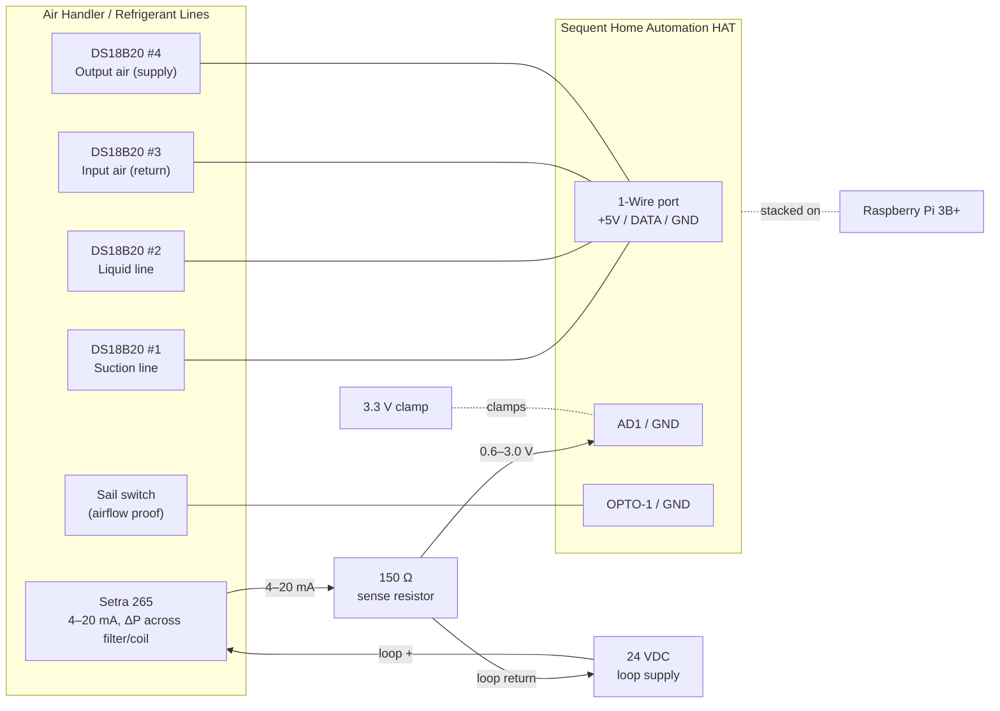

# Hardware & Wiring

This document describes the physical build: bill of materials, the I/O map on the
Sequent Home Automation HAT, per-sensor wiring, and the OS-level setup needed for the
1-Wire bus.

> **Every field signal now terminates on the Sequent HAT.** An earlier revision used a
> digital I²C pressure sensor (Sensirion SDP810) that had to hang off the Pi's I²C
> header; it's been replaced by a **Setra Model 265** analog transmitter whose **4–20 mA**
> output drops a voltage across a sense resistor into a HAT analog input. Nothing
> field-wired touches the Pi header anymore.

## 1. Bill of materials

| Qty | Item | Notes |
|-----|------|-------|
| 1 | Raspberry Pi 3B+ | Any Pi with the 40-pin header works |
| 1 | Sequent Microsystems Home Automation HAT | Stack level 0 (DIP switches → all off) |
| 1 | 5 V / ≥3 A regulated power supply | Powers Pi + HAT |
| 4 | DS18B20 temperature probe (waterproof, 3-wire) | 1-Wire, multidrop on one bus. 2× pipe-clamp/strap-on style for the refrigerant lines |
| 1 | 4.7 kΩ resistor | 1-Wire pull-up, DATA→+3.3 V (only if HAT does not already provide one — verify) |
| 1 | **Setra Model 265** differential pressure transmitter, P/N **`26512R5WD11T1C`** | 0–2.5″ W.C. unidirectional, 4–20 mA, 24 VDC, terminal strip, ±1 %. Air only; ambient 0–150 °F |
| 1 | 24 VDC supply for the 4–20 mA loop | Small wall-wart, or rectify+smooth the existing 24 VAC (peak ~34 V) |
| 1 | Resistor: **150 Ω** (¼ W, 0.1 %) | Sense resistor: converts 4–20 mA → ~0.6–3.0 V for the ADC |
| 1 | 3.3 V TVS/Zener clamp (e.g. SMAJ3.3A / 3.3 V Zener) | Across `AD1`→`GND`; protects the input if the sense resistor opens |
| 2 | Silicone/PVC pressure tubing + static pressure tips | One tap upstream, one downstream of the filter/coil |
| 1 | Sail switch (air-proving switch, SPDT dry contact) | e.g. a furnace/duct sail switch |
| — | Ferrules / 26–16 AWG wire | HAT uses pluggable screw terminals |

### Sensor selection notes (Setra 265)

- **Range:** the 265 has **no 0–2″ option** — standard unidirectional steps are 1″, **2.5″**,
  5″. Use **0–2.5″ W.C.** (`26512R5WD11T1C`) for residential filter/coil loading: a clean
  filter reads ~0.1–0.3″, a dirty one ~0.5–1″, leaving headroom. Alternatives:
  **0–1″** (`2651001WD11T1C`) for max resolution, or **0–5″** (`2651005WD11T1C`) to track
  total external static pressure. Whichever you pick, only `range_inh2o` in `config.yaml`
  changes — the 4–20 mA electrical scaling is identical.
- **Output:** the **4–20 mA** option (excitation/output code `11` = 24 VDC / 4–20 mA) is
  used here. A current loop is inherently safe for a 3.3 V-max input: the ADC voltage is set
  by the sense resistor (current × R), so it can't exceed ~3 V in normal operation regardless
  of the transmitter or its supply — unlike a 0–5/0–10 V output, which is hotter than the
  input and relies on a divider staying honest.
- **Power:** a 4–20 mA transmitter is 2-wire *loop powered* and needs **24 VDC** (9–30 VDC
  range). Use a small 24 VDC supply, or rectify+smooth the existing 24 VAC. Only the loop's
  two wires + the sense resistor land on the HAT.

## 2. HAT I/O map

The Sequent Home Automation HAT is driven over I²C by the Pi (via Sequent's `SMioplus`
Python library / `ioplus` CLI). Everything not listed is spare for future
control/expansion.

| HAT resource | Terminal | Assigned to | Type |
|---|---|---|---|
| 1-Wire port | `1-WIRE` / `+5V` / `GND` (top-left) | 4× DS18B20 | Kernel `w1` driver |
| Analog input 1 | `AD1` / `GND` | Setra 265 pressure (via 150 Ω sense resistor) | 0–3.3 V ADC |
| Opto input 1 | `OPTO-1` / `GND` | Sail switch | Contact closure |
| Opto input 2 | `OPTO-2` | *(future)* Call for heat — W | Contact closure |
| Opto input 3 | `OPTO-3` | *(future)* Call for cool — Y | Contact closure |
| Opto input 4 | `OPTO-4` | *(future)* Fan — G | Contact closure |
| Analog in 2–8 | `AD2`–`AD8` | Spare (thermistor option) | 0–3.3 V |
| Relays / 0–10 V / open-drain | — | Spare (future control) | — |

## 3. Wiring diagram



The 150 Ω sense resistor sits between `AD1` and `GND`; the loop current flows
`24 VDC +` → Setra → the sense resistor → `GND` → back to `24 VDC −`, and `AD1`
reads the voltage developed across the resistor. Tie the loop supply `−` to HAT `GND`.

## 4. Temperature probes — DS18B20 (1-Wire)

All four probes share **one** 1-Wire bus (parallel/multidrop): every probe's data line
ties to `1-WIRE`, VDD to `+5V`, and GND to `GND`. Each DS18B20 has a unique 64-bit ROM
ID, so the software reads them individually.

- **VDD wiring, not parasitic:** use the full 3-wire connection (VDD + DATA + GND) for
  reliable multidrop over duct-length runs.
- **Pull-up:** 1-Wire needs a ~4.7 kΩ pull-up from DATA to 3.3 V. Confirm whether the HAT
  populates one on its 1-Wire port; if not, add one externally. (Do **not** add four —
  one per bus.)
- **Probe roles** (map ROM IDs → roles in `config.yaml`):
  - T1 **Suction line** — strap to the large, insulated refrigerant line (cold in cooling);
    with the liquid line it indicates refrigerant-side behavior. Insulate over the sensor.
  - T2 **Liquid line** — strap to the small, warm refrigerant line (subcooling/charge indicator).
  - T3 **Input air** — return air entering the coil/air handler.
  - T4 **Output air** — supply air leaving the coil.

> **Refrigerant-line note:** clamp the probe tightly to clean copper and cover it with
> pipe insulation so it reads pipe temperature, not room air. True superheat/subcooling
> needs refrigerant *pressures* too (not measured here), but the raw line temperatures are
> strong trend/fault indicators on their own (e.g. a warm suction line → low charge or low
> airflow; a very hot liquid line → overcharge or a dirty condenser).

### OS setup for 1-Wire

The Sequent 1-Wire port is wired to **GPIO4** (the kernel `w1-gpio` default). Enable it:

```bash
sudo raspi-config     # → Interface Options → 1-Wire → Enable   (this is P7)
# or add to /boot/firmware/config.txt:
#   dtoverlay=w1-gpio
sudo reboot
```

After reboot, each probe appears as `/sys/bus/w1/devices/28-XXXXXXXXXXXX/temperature`.

## 5. Differential pressure — Setra Model 265 (4–20 mA, on the HAT)

The Setra 265 is configured for **4–20 mA** output: a 2-wire loop where the transmitter
regulates the loop current in proportion to differential pressure. A **150 Ω** sense
resistor converts that current into a voltage the HAT's 0–3.3 V ADC can read. Because the
voltage is `current × resistor`, it is bounded by design and can't exceed the input's
3.3 V max in normal operation — the reason this beats a 0–5/0–10 V output + divider.

### Datasheet check (Model 265)

Verified against the Setra Operating Instructions + Data Sheet (ordering guide):

- **Part number: `26512R5WD11T1C`** — decoded from Setra's matrix: `2651` (Model 265) +
  `2R5WD` (0–2.5″ W.C. unidirectional) + `11` (24 VDC / 4–20 mA) + `T1` (terminal strip) +
  `C` (±1 % FS). This is Setra's own catalog *example* configuration, so it's a standard build.
- **The 265 also ships as 0–5 V / 0–10 V** — codes `2B` / `AB` / `AC`. Make sure the label
  reads the 4–20 mA code `11`; same body, different unit.
- **Use 150 Ω — *not* Setra's factory 250 Ω load.** Setra calibrates the loop at 24 VDC /
  250 Ω, but 250 Ω × 20 mA = **5 V**, which exceeds the HAT's 3.3 V input. The current output
  is spec'd to drive an **external load of 0–800 Ω**, so 150 Ω (→ 3.0 V full scale) is well
  inside range; the small load-change error is trimmed by the two-point software calibration.
- **Loop supply is fine.** Setra's own limits: min = `9 + 0.02 × R` ≈ **12 V** at 150 Ω,
  max = `30 + 0.004 × R` ≈ **30.6 V**. Our 24 VDC sits comfortably between.
- **Limits:** clean air / non-conducting gas only; ambient **0–150 °F** (mind attic heat);
  overpressure & max line pressure 10 PSI (duct pressure is far below); accuracy **±1 % FS**.
- **Ports:** front-labeled **HIGH** / **LOW**, ¼″ push-on fittings (3/16″ ID tube suggested).

### Wiring (2-wire current loop)

```
  24 VDC (+) ──▶ Setra 265 ──▶ AD1 ──[ 150 Ω ]── GND ──▶ 24 VDC (−)
                              (node)          (sense R)
```

| Node | Connect |
|---|---|
| 24 VDC supply `+` | Setra 265 `+ (EXC)` terminal |
| Setra 265 `− (COM)` terminal | HAT `AD1` **and** the top of the 150 Ω sense resistor |
| Sense resistor bottom | HAT `GND` **and** 24 VDC supply `−` (shared reference) |

Setra's current-loop terminals are labeled **+ (EXC)** and **− (COM)**; current flows in
the `+` terminal and returns through the `−` terminal, so the sense resistor sits in the
return leg (low-side) with its bottom at `GND`.

Add the **3.3 V TVS/Zener clamp** across `AD1`→`GND`. If the sense resistor ever opens,
the current source would otherwise drive `AD1` toward the loop supply voltage; the clamp
pins it at 3.3 V.

### Scaling math

With `Rsense = 150 Ω` and the analog input's built-in **15 kΩ pull-up to 3.3 V**, the ADC
sees roughly:

| Loop current | Pressure | `AD1` voltage |
|---|---|---|
| 4 mA | 0″ W.C. | ≈ 0.63 V |
| 20 mA | 2.5″ W.C. (full scale) | ≈ 3.00 V |
| ~22 mA | over-range / saturated | ≈ 3.30 V (at the limit — hence the clamp) |

The 15 kΩ pull-up adds a small offset (~0.03 V); it's linear and removed by calibration.
The usable span (~0.63–3.00 V) still fills most of the ADC → ~2,950 counts across range.

### Tubing & calibration

- **Tubing:** upstream (high-pressure) tap → the 265's **High/+** port; downstream tap →
  **Low/−** port, so a loading filter reads as increasing positive ΔP.
- **Calibrate** in software: two measured `volts → inH₂O` points in `config.yaml` (the
  4 mA "zero" reading and a known ΔP), refined against a manometer. The board's two-point
  `cuin` analog-input calibration can also true up the raw voltage.
  See [`config/config.example.yaml`](../config/config.example.yaml).

## 6. Sail switch (airflow proof)

A sail switch is a simple SPDT dry contact that closes when duct airflow deflects its
vane. Wire the **normally-open** contact between `OPTO-1` and `GND`:

- Airflow present → contact closed → opto input reads **active**.
- No airflow → contact open → opto input reads **inactive**.

The opto inputs already have a 1 kΩ pull-up to 5 V internally, so no external components
are needed for a dry-contact sail switch.

## 7. Future: thermostat call signals (24 VAC)

Deferred to a later phase (see [roadmap](roadmap.md)), but the design intent is recorded
here so the panel can be pre-wired.

The thermostat's **W** (heat), **Y** (cool), and **G** (fan) signals are **24 VAC**, and
the HAT's opto inputs are **dry-contact** inputs (they expect a closure to ground, not a
live AC voltage). Do **not** feed 24 VAC directly into an opto input.

Recommended interface: a small **24 VAC pilot/isolation relay** per signal (e.g. a
Functional Devices RIB relay or a 24 VAC ice-cube relay). The thermostat wire drives the
relay **coil**; the relay's **dry contact** wires into the opto input + GND — exactly like
the sail switch. This is fully isolated and non-invasive (it only senses the call, it
does not interrupt it). Planned mapping: W→OPTO-2, Y→OPTO-3, G→OPTO-4.

## 8. Safety notes

- Keep 24 VAC (and any line-voltage) wiring physically separated from the low-voltage
  sensor wiring; only isolated dry contacts should reach the HAT opto inputs.
- The 24 VDC feeding the current loop should be fused/limited; if you derive it from the
  HVAC transformer, confirm capacity for the extra (small) load.
- Fit the 3.3 V clamp on `AD1` and verify the full-scale (20 mA) voltage is under 3.3 V
  before relying on it — the 150 Ω resistor keeps normal operation at ~3.0 V.
- Power the Pi + HAT from a single regulated 5 V supply rated well above the combined
  load (the HAT alone can draw ~750 mA with all relays on; we use none, but size for headroom).
- Observe the Setra 265's rated overpressure limit — it's a low-pressure duct transmitter,
  not a line-pressure gauge.
```


<invoke name="Read">
<parameter name="file_path">/Users/jeffstrout/Library/Mobile Documents/com~apple~CloudDocs/Personal/AC Monitor/docs/mqtt-homeassistant.md