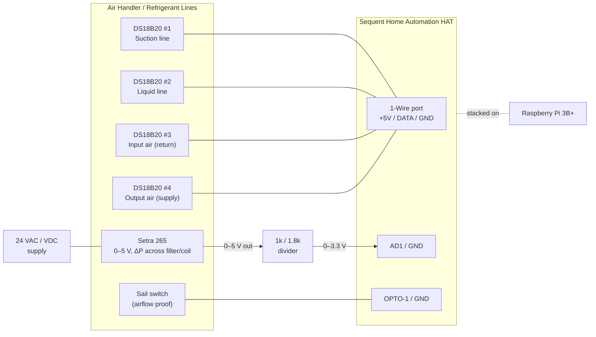

# Hardware & Wiring

This document describes the physical build: bill of materials, the I/O map on the
Sequent Home Automation HAT, per-sensor wiring, and the OS-level setup needed for the
1-Wire bus.

> **Every field signal now terminates on the Sequent HAT.** An earlier revision used a
> digital I²C pressure sensor (Sensirion SDP810) that had to hang off the Pi's I²C
> header; it's been replaced by a **Setra Model 265** analog transmitter whose 0–5 V
> output lands on a HAT analog input. Nothing field-wired touches the Pi header anymore.

## 1. Bill of materials

| Qty | Item | Notes |
|-----|------|-------|
| 1 | Raspberry Pi 3B+ | Any Pi with the 40-pin header works |
| 1 | Sequent Microsystems Home Automation HAT | Stack level 0 (DIP switches → all off) |
| 1 | 5 V / ≥3 A regulated power supply | Powers Pi + HAT |
| 4 | DS18B20 temperature probe (waterproof, 3-wire) | 1-Wire, multidrop on one bus. 2× pipe-clamp/strap-on style for the refrigerant lines |
| 1 | 4.7 kΩ resistor | 1-Wire pull-up, DATA→+3.3 V (only if HAT does not already provide one — verify) |
| 1 | **Setra Model 265** differential pressure transmitter | Unidirectional **0–2″ W.C.**, **0–5 VDC** output, 24 VAC powered |
| 1 | 24 VAC source (or 24 VDC supply) for the Setra 265 | Tap the HVAC transformer (R/C) or use a small dedicated supply |
| 2 | Resistor: 1 kΩ + 1.8 kΩ (¼ W, 1 %) | Voltage divider scaling the 0–5 V output into the 0–3.3 V ADC |
| 2 | Silicone/PVC pressure tubing + static pressure tips | One tap upstream, one downstream of the filter/coil |
| 1 | Sail switch (air-proving switch, SPDT dry contact) | e.g. a furnace/duct sail switch |
| — | Ferrules / 26–16 AWG wire | HAT uses pluggable screw terminals |

### Sensor selection notes (Setra 265)

- **Range:** unidirectional **0–2″ W.C.** suits residential filter/coil loading — a clean
  filter reads ~0.1–0.3″, a dirty one ~0.5–1″, with headroom. (0–1″ for max resolution,
  0–5″ if you'd rather track total external static pressure.)
- **Output:** the **0–5 VDC** option pairs with the simple 1 kΩ/1.8 kΩ divider below.
  (A 0–10 V option would just need a different divider ratio.)
- **Power:** the 265 needs 24 VAC or 9–30 VDC — the HAT's +5 V rail is **not** enough, so
  power comes from a 24 VAC/DC source. Only the *signal* + *ground* land on the HAT.

## 2. HAT I/O map

The Sequent Home Automation HAT is driven over I²C by the Pi (via Sequent's `SMioplus`
Python library / `ioplus` CLI). Everything not listed is spare for future
control/expansion.

| HAT resource | Terminal | Assigned to | Type |
|---|---|---|---|
| 1-Wire port | `1-WIRE` / `+5V` / `GND` (top-left) | 4× DS18B20 | Kernel `w1` driver |
| Analog input 1 | `AD1` / `GND` | Setra 265 pressure (via divider) | 0–3.3 V ADC |
| Opto input 1 | `OPTO-1` / `GND` | Sail switch | Contact closure |
| Opto input 2 | `OPTO-2` | *(future)* Call for heat — W | Contact closure |
| Opto input 3 | `OPTO-3` | *(future)* Call for cool — Y | Contact closure |
| Opto input 4 | `OPTO-4` | *(future)* Fan — G | Contact closure |
| Analog in 2–8 | `AD2`–`AD8` | Spare (thermistor option) | 0–3.3 V |
| Relays / 0–10 V / open-drain | — | Spare (future control) | — |

## 3. Wiring diagram



## 4. Temperature probes — DS18B20 (1-Wire)

All four probes share **one** 1-Wire bus (parallel/multidrop): every probe's data line
ties to `1-WIRE`, VDD to `+5V`, and GND to `GND`. Each DS18B20 has a unique 64-bit ROM
ID, so the software reads them individually.

- **VDD wiring, not parasitic:** use the full 3-wire connection (VDD + DATA + GND) for
  reliable multidrop over duct-length runs.
- **Pull-up:** 1-Wire needs a ~4.7 kΩ pull-up from DATA to 3.3 V. Confirm whether the HAT
  populates one on its 1-Wire port; if not, add one externally. (Do **not** add four —
  one per bus.)
- **Probe roles** (map ROM IDs → roles in `config.yaml`):
  - T1 **Suction line** — strap to the large, insulated refrigerant line (cold in cooling);
    with the liquid line it indicates refrigerant-side behavior. Insulate over the sensor.
  - T2 **Liquid line** — strap to the small, warm refrigerant line (subcooling/charge indicator).
  - T3 **Input air** — return air entering the coil/air handler.
  - T4 **Output air** — supply air leaving the coil.

> **Refrigerant-line note:** clamp the probe tightly to clean copper and cover it with
> pipe insulation so it reads pipe temperature, not room air. True superheat/subcooling
> needs refrigerant *pressures* too (not measured here), but the raw line temperatures are
> strong trend/fault indicators on their own (e.g. a warm suction line → low charge or low
> airflow; a very hot liquid line → overcharge or a dirty condenser).

### OS setup for 1-Wire

The Sequent 1-Wire port is wired to **GPIO4** (the kernel `w1-gpio` default). Enable it:

```bash
sudo raspi-config     # → Interface Options → 1-Wire → Enable   (this is P7)
# or add to /boot/firmware/config.txt:
#   dtoverlay=w1-gpio
sudo reboot
```

After reboot, each probe appears as `/sys/bus/w1/devices/28-XXXXXXXXXXXX/temperature`.

## 5. Differential pressure — Setra Model 265 (analog, on the HAT)

The Setra 265 is a 3-wire analog transmitter: it takes 24 VAC/DC power and outputs a
0–5 VDC signal proportional to differential pressure. The HAT's analog inputs read
**0–3.3 V**, so a resistor divider scales the 0–5 V output before it reaches `AD1`.

### Wiring

| Setra 265 | Connect to |
|---|---|
| Power (+) | 24 VAC/VDC supply hot |
| Power (−) / common | 24 VAC/VDC supply common **and** HAT `GND` (shared reference) |
| Output (0–5 V) | Top of divider → `R1` (1 kΩ) |

Divider: `Setra OUT → R1 (1 kΩ) → node → R2 (1.8 kΩ) → GND`. The **node** goes to HAT
`AD1`. Tie the Setra common, `R2` bottom, and HAT `GND` together so everything shares one
reference.

### Scaling math

With `R1 = 1 kΩ`, `R2 = 1.8 kΩ`, and the analog input's built-in **15 kΩ pull-up to
3.3 V**, the ADC sees roughly:

- **0″ W.C.** (0 V out) → **≈ 0.14 V** at `AD1`
- **2″ W.C.** (5 V out) → **≈ 3.22 V** at `AD1`  (safely under the 3.3 V max)

The 15 kΩ pull-up adds a small offset/gain shift; it's linear and removed by calibration.

### Tubing & calibration

- **Tubing:** upstream (high-pressure) tap → the 265's **High/+** port; downstream tap →
  **Low/−** port, so a loading filter reads as increasing positive ΔP.
- **Calibrate** either in software (two measured `volts → inH₂O` points in `config.yaml`,
  refined against a manometer) or with the board's two-point `cuin` analog-input
  calibration. See [`config/config.example.yaml`](../config/config.example.yaml).

## 6. Sail switch (airflow proof)

A sail switch is a simple SPDT dry contact that closes when duct airflow deflects its
vane. Wire the **normally-open** contact between `OPTO-1` and `GND`:

- Airflow present → contact closed → opto input reads **active**.
- No airflow → contact open → opto input reads **inactive**.

The opto inputs already have a 1 kΩ pull-up to 5 V internally, so no external components
are needed for a dry-contact sail switch.

## 7. Future: thermostat call signals (24 VAC)

Deferred to a later phase (see [roadmap](roadmap.md)), but the design intent is recorded
here so the panel can be pre-wired.

The thermostat's **W** (heat), **Y** (cool), and **G** (fan) signals are **24 VAC**, and
the HAT's opto inputs are **dry-contact** inputs (they expect a closure to ground, not a
live AC voltage). Do **not** feed 24 VAC directly into an opto input.

Recommended interface: a small **24 VAC pilot/isolation relay** per signal (e.g. a
Functional Devices RIB relay or a 24 VAC ice-cube relay). The thermostat wire drives the
relay **coil**; the relay's **dry contact** wires into the opto input + GND — exactly like
the sail switch. This is fully isolated and non-invasive (it only senses the call, it
does not interrupt it). Planned mapping: W→OPTO-2, Y→OPTO-3, G→OPTO-4.

## 8. Safety notes

- Keep 24 VAC (and any line-voltage) wiring physically separated from the low-voltage
  sensor wiring; only isolated dry contacts should reach the HAT opto inputs.
- The 24 VAC feeding the Setra 265 should be fused/limited; if you tap the HVAC
  transformer, confirm it has capacity for the extra (small) load.
- Never let the divided pressure signal exceed the analog input's 3.3 V maximum — verify
  the `AD1` voltage at full scale before relying on it.
- Power the Pi + HAT from a single regulated 5 V supply rated well above the combined
  load (the HAT alone can draw ~750 mA with all relays on; we use none, but size for headroom).
- Observe the Setra 265's rated overpressure limit — it's a low-pressure duct transmitter,
  not a line-pressure gauge.
```


<invoke name="Read">
<parameter name="file_path">/Users/jeffstrout/Library/Mobile Documents/com~apple~CloudDocs/Personal/AC Monitor/docs/mqtt-homeassistant.md