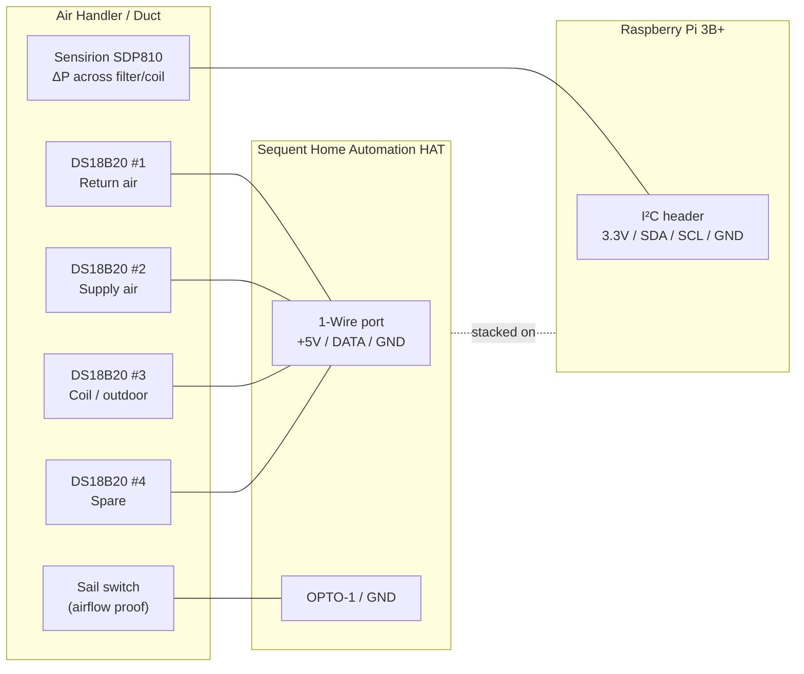

# Hardware & Wiring

This document describes the physical build: bill of materials, the I/O map on the
Sequent Home Automation HAT, per-sensor wiring, and the OS-level setup needed for the
1-Wire and I²C buses.

## 1. Bill of materials

| Qty | Item | Notes |
|-----|------|-------|
| 1 | Raspberry Pi 3B+ | Any Pi with the 40-pin header works |
| 1 | Sequent Microsystems Home Automation HAT | Stack level 0 (DIP switches → all off) |
| 1 | 5 V / ≥3 A regulated power supply | Powers Pi + HAT |
| 4 | DS18B20 temperature probe (waterproof, 3-wire) | 1-Wire, multidrop on one bus |
| 1 | 4.7 kΩ resistor | 1-Wire pull-up, DATA→+3.3 V (only if HAT does not already provide one — verify) |
| 1 | Sensirion **SDP810-125Pa** or **SDP810-500Pa** | Digital differential pressure, I²C. Tube-connection version for duct use |
| 2 | Silicone/PVC pressure tubing + static pressure tips | One tap upstream, one downstream of the filter/coil |
| 1 | Sail switch (air-proving switch, SPDT dry contact) | e.g. a furnace/duct sail switch |
| — | Ferrules / 26–16 AWG wire | HAT uses pluggable screw terminals |

### Sensor range selection (SDP810)

The SDP8xx-**125Pa** part (±125 Pa ≈ ±0.5 inH₂O) gives the best resolution for a clean
residential filter. If you expect a very restrictive filter or want coil ΔP headroom,
the **500Pa** part (±500 Pa ≈ ±2 inH₂O) is safer. Both are ±, 16-bit, and read pressure
**and** an internal temperature over I²C.

- Tube-connection variants (SDP810) have hose barbs — ideal for a duct install.
- I²C address is `0x25` (SDP8x0) or `0x26` (SDP8x1). Default plan assumes **`0x25`**.

## 2. HAT I/O map

The Sequent Home Automation HAT is driven over I²C by the Pi (via Sequent's `SMioplus`
Python library / `ioplus` CLI). Only three of its subsystems are used in the current
design; everything else is spare for future control/expansion.

| HAT resource | Terminal | Assigned to | Type |
|---|---|---|---|
| 1-Wire port | `1-WIRE` / `+5V` / `GND` (top-left) | 4× DS18B20 | Kernel `w1` driver |
| Opto input 1 | `OPTO-1` / `GND` | Sail switch | Contact closure |
| Opto input 2 | `OPTO-2` | *(future)* Call for heat — W | Contact closure |
| Opto input 3 | `OPTO-3` | *(future)* Call for cool — Y | Contact closure |
| Opto input 4 | `OPTO-4` | *(future)* Fan — G | Contact closure |
| Analog in 1–8 | `ADC1`–`ADC8` | Spare (thermistor option) | 0–3.3 V |
| Relays / 0–10 V / open-drain | — | Spare (future control) | — |

The differential pressure sensor is **not** on this table — see §5.

## 3. Wiring diagram



## 4. Temperature probes — DS18B20 (1-Wire)

All four probes share **one** 1-Wire bus (parallel/multidrop): every probe's data line
ties to `1-WIRE`, VDD to `+5V`, and GND to `GND`. Each DS18B20 has a unique 64-bit ROM
ID, so the software reads them individually.

- **VDD wiring, not parasitic:** use the full 3-wire connection (VDD + DATA + GND) for
  reliable multidrop over duct-length runs.
- **Pull-up:** 1-Wire needs a ~4.7 kΩ pull-up from DATA to 3.3 V. Confirm whether the HAT
  populates one on its 1-Wire port; if not, add one externally. (Do **not** add four —
  one per bus.)
- **Probe roles** (map ROM IDs → roles in `config.yaml`):
  - T1 **Return air** — before the coil
  - T2 **Supply air** — after the coil
  - T3 **Coil / outdoor** — coil surface or outdoor reference
  - T4 **Spare** — room/plenum

### OS setup for 1-Wire

The Sequent 1-Wire port is wired to **GPIO4** (the kernel `w1-gpio` default). Enable it:

```bash
sudo raspi-config     # → Interface Options → 1-Wire → Enable   (this is P7)
# or add to /boot/firmware/config.txt:
#   dtoverlay=w1-gpio
sudo reboot
```

After reboot, each probe appears as `/sys/bus/w1/devices/28-XXXXXXXXXXXX/temperature`.

## 5. Differential pressure — Sensirion SDP810 (I²C)

**Important:** the SDP810 is a digital I²C sensor with no analog output, so it **cannot**
land on the HAT's screw terminals. Its four wires connect to the **Pi's I²C header**,
which the HAT already uses — the SDP810 simply shares the bus at a different address, so
there is no conflict.

| SDP810 pin | Connect to (Pi 40-pin) |
|---|---|
| VDD | 3.3 V (pin 1) — **not** 5 V; SDA/SCL are referenced to VDD and the Pi bus is 3.3 V |
| GND | GND (pin 6/9) |
| SDA | GPIO2 / SDA1 (pin 3) |
| SCL | GPIO3 / SCL1 (pin 5) |

- Power at **3.3 V** so the I²C lines stay within the Pi's logic levels.
- **Tubing:** upstream tap → sensor `+` port, downstream tap → sensor `−` port, so a
  loaded filter reads as increasing positive ΔP.
- Enable I²C: `raspi-config` → Interface Options → I²C (P5). Verify with
  `i2cdetect -y 1` — you should see the HAT's address(es) **and** `0x25`.

### Why this is the one exception to "everything through the HAT"

The design goal is to land all *field* terminations at the HAT. That holds for the
temperature probes and the sail switch. The SDP810 is the exception because it is a
bus-level digital peripheral, not a field-wired analog signal — there is no HAT terminal
that carries I²C to a sensor. (An analog 0–5 V pressure transducer *could* route through
a HAT analog input instead, if landing everything on the HAT ever outweighs the SDP810's
far better accuracy. Not recommended — noted only for completeness.)

## 6. Sail switch (airflow proof)

A sail switch is a simple SPDT dry contact that closes when duct airflow deflects its
vane. Wire the **normally-open** contact between `OPTO-1` and `GND`:

- Airflow present → contact closed → opto input reads **active**.
- No airflow → contact open → opto input reads **inactive**.

The opto inputs already have a 1 kΩ pull-up to 5 V internally, so no external components
are needed for a dry-contact sail switch.

## 7. Future: thermostat call signals (24 VAC)

Deferred to a later phase (see [roadmap](docs/roadmap.md)), but the design intent is
recorded here so the panel can be pre-wired.

The thermostat's **W** (heat), **Y** (cool), and **G** (fan) signals are **24 VAC**, and
the HAT's opto inputs are **dry-contact** inputs (they expect a closure to ground, not a
live AC voltage). Do **not** feed 24 VAC directly into an opto input.

Recommended interface: a small **24 VAC pilot/isolation relay** per signal (e.g. a
Functional Devices RIB relay or a 24 VAC ice-cube relay). The thermostat wire drives the
relay **coil**; the relay's **dry contact** wires into the opto input + GND — exactly like
the sail switch. This is fully isolated and non-invasive (it only senses the call, it
does not interrupt it). Planned mapping: W→OPTO-2, Y→OPTO-3, G→OPTO-4.

## 8. Safety notes

- Keep 24 VAC (and any line-voltage) wiring physically separated from the low-voltage
  sensor wiring; only isolated dry contacts should reach the HAT opto inputs.
- Power the Pi + HAT from a single regulated 5 V supply rated well above the combined
  load (the HAT alone can draw ~750 mA with all relays on; we use none, but size for headroom).
- Observe the SDP810's 1 bar max overpressure — it's a low-pressure duct sensor, not a
  line-pressure gauge.
